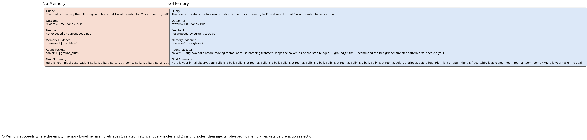
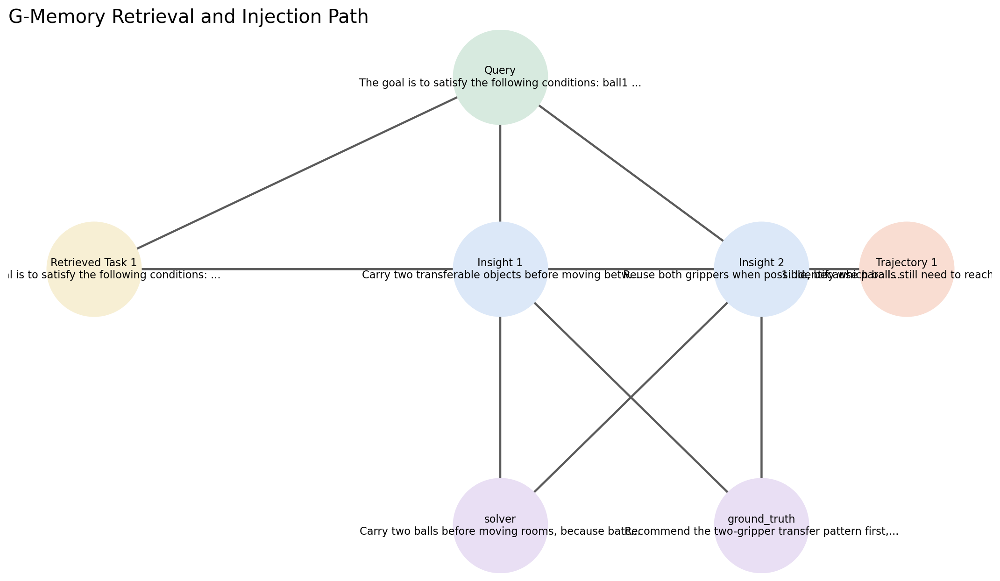

# G-Memory Poster Demo

Presentation-ready course-project demo layer for the paper "G-Memory: Tracing Hierarchical Memory for Multi-Agent Systems."

This repository is built to make the method easy to show in a poster session:

- it reuses the official G-Memory code path instead of reimplementing the method
- it exposes the memory pipeline with clean figures and structured compare outputs
- it ships a replay-safe fallback and an executed notebook for reliable local demos

## Open These First

- [Latest verified results](demo/LATEST_RESULTS.md)
 - [Quickstart](demo/QUICKSTART.md)
- [Main notebook with outputs](demo/GMemory_Poster_Demo.ipynb)
- [Full demo documentation](demo/README.md)

## Latest Verified Local Demo Run

This is a small local demo run, not a paper benchmark reproduction.

| Item | Value |
| --- | --- |
| Task | `pddl` |
| Scenario | `gripper` task |
| MAS type | `autogen` |
| Backend | `mock` |
| No-memory baseline | `reward=0.75`, `done=False` |
| G-Memory | `reward=1.0`, `done=True` |
| Outcome delta | G-Memory succeeds where the empty-memory baseline fails |





## What This Repo Contains

- `demo/`: the presentation layer, notebook, scripts, docs, cached runs, and poster-friendly figures
- `demo/published/`: stable result assets used by the GitHub landing page
- `official_gmemory/`: expected local checkout of the authors' official repo, bootstrapped separately

## Setup

1. Clone this repo.
2. Fetch the official upstream repo into `official_gmemory/`:

```bash
python demo/scripts/bootstrap_official_repo.py
```

3. Create an environment and install the demo requirements:

```bash
python -m venv .venv
source .venv/bin/activate
pip install -r demo/requirements-demo.txt
```

4. Verify the environment:

```bash
python demo/scripts/check_environment.py
```

## Run The Demo

Smoke test:

```bash
python demo/scripts/run_smoke_demo.py --demo-mode mock
```

Main compare:

```bash
python demo/scripts/run_live_compare.py --demo-mode mock
```

Replay fallback:

```bash
python demo/scripts/run_replay_demo.py
```

Publish the latest results to the stable GitHub-visible snapshot:

```bash
python demo/scripts/publish_demo_snapshot.py
```

## Attribution

The original method and codebase are from the official G-Memory authors:

Zhang, Guibin and Fu, Muxin and Wan, Guancheng and Yu, Miao and Wang, Kun and Yan, Shuicheng.  
"G-Memory: Tracing Hierarchical Memory for Multi-Agent Systems."

This repository adds a course-project demo and presentation layer on top of that work.
