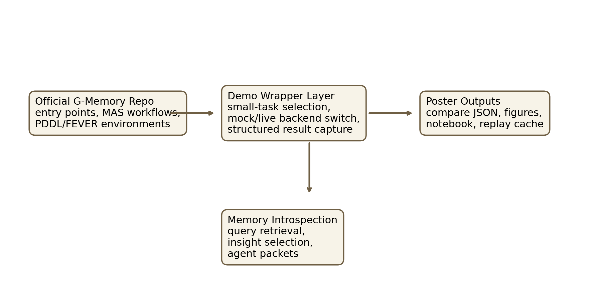

# Latest Verified Results

This page is the stable snapshot used by the repository landing page.
It is regenerated from the latest successful compare record with `publish_demo_snapshot.py`.

- Run id: `pddl-autogen-mock-20260419T043651Z`
- Backend: `mock`
- Task: `pddl`
- MAS type: `autogen`
- Delta summary: G-Memory succeeds where the empty-memory baseline fails. It retrieves 1 related historical query nodes and 2 insight nodes, then injects role-specific memory packets before action selection.

## Outcome Table

| Mode | Reward | Done | Runtime (s) |
| --- | --- | --- | --- |
| No memory | `0.75` | `False` | `0.05717921257019043` |
| G-Memory | `1.0` | `True` | `0.035054683685302734` |

## Retrieved Memory Evidence

- Historical query candidates exposed: `1`
- Successful trajectories exposed: `1`
- Insight nodes exposed: `2`
- Agent memory packets exposed: `2`

## Compare Figure

## Memory Flow Figure

## Architecture Figure

## Raw Artifact

- [Stable compare JSON](./published/latest_compare.json)
